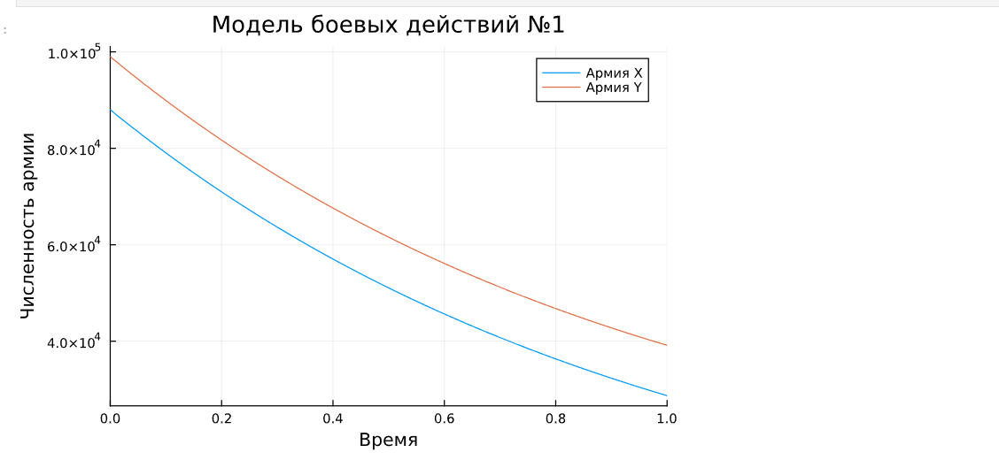
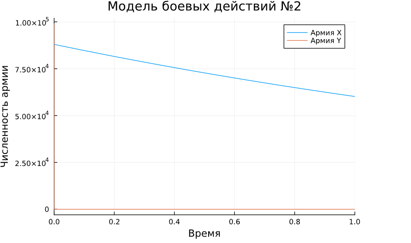
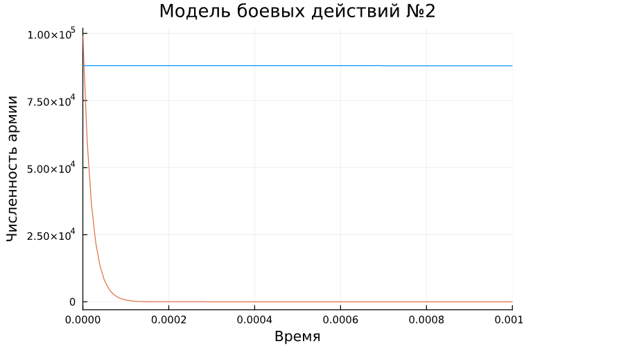

---
## Front matter
lang: ru-RU
title: Лабораторная работа №3
subtitle: Модель боевых действий
author:
  - Городянский Фёдор Николаевич
institute:
  - Российский университет дружбы народов, Москва, Россия

## i18n babel
babel-lang: russian
babel-otherlangs: english

## Formatting pdf
toc: false
toc-title: Содержание
slide_level: 2
aspectratio: 169
section-titles: true
theme: metropolis
header-includes:
  - \usepackage{fontspec}
  - \setmainfont{FreeSerif}
  - \setsansfont{FreeSans}
  - \setmonofont{FreeMono}
---

# Информация

## Докладчик

:::::::::::::: {.columns align=center}
::: {.column width="70%"}

  * Городянский Фёдор Николаевич
  * студент
  * Российский университет дружбы народов
  * [1132226456@pfur.ru](mailto:1132226456@pfur.ru)
  * <https://Fedass.github.io/ru/>

:::
::: {.column width="25%"}

:::
::::::::::::::

## Цель работы

Построить модель боевых действий на языке прогаммирования Julia.

## Задание

Построить графики изменения численности войск армии $X$ и армии $Y$ для  следующих случаев:

1. Модель боевых действий между регулярными войсками

2. Модель ведение боевых действий с участием регулярных войск и партизанских отрядов

# Выполнение лабораторной работы

## Модель боевых действий между регулярными войсками

 $$\begin{cases}
    \dfrac{dx}{dt} = -0.45x(t)- 0.55y(t)+sin(t + 15)\\
    \dfrac{dy}{dt} = -0.58x(t)- 0.45y(t)+cos(t + 3)
\end{cases}$$

## Модель боевых действий между регулярными войсками

```Julia
using DifferentialEquations, Plots;

function reg(u, p, t)
    x, y = u
    a, b, c, h = p
    dx = -a*x - b*y+sin(t  + 15)
    dy = -c*x -h*y+cos(t + 3)
    return [dx, dy]
end
```
## Модель боевых действий между регулярными войсками

```Julia
# начальные условия
u0 = [88000, 99000]
p = [0.45, 0.55, 0.58, 0.45]
tspan = (0,1)
```

## Модель боевых действий между регулярными войсками

```Julia
prob = ODEProblem(reg, u0, tspan, p)
sol = solve(prob, Tsit5())
plot(sol)
```

## Модель боевых действий между регулярными войсками

{#fig:001 width=70%}


## Модель ведение боевых действий с участием регулярных войск и партизанских отрядов

$$\begin{cases}
    \dfrac{dx}{dt} = -0.38x(t)-0.67y(t)+sin(7t) + 1\\
    \dfrac{dy}{dt} = -0.57x(t)y(t)-0.39y(t)+cos(8t) + 1
\end{cases}$$


## Модель ведение боевых действий с участием регулярных войск и партизанских отрядов

```Julia
function reg_part(u, p, t)
    x, y = u
    a, b, c, h = p
    dx = -a*x - b*y+sin(7*t)+1
    dy = -c*x*y -h*y+cos(8*t)+1
    return [dx, dy]
end
```

## Модель ведение боевых действий с участием регулярных войск и партизанских отрядов

```Julia
u0 = [88000, 99000]
p = [0.38, 0.67, 0.57, 0.39]
tspan = (0,1)
```

## Модель ведение боевых действий с участием регулярных войск и партизанских отрядов

```Julia
prob2 = ODEProblem(reg_part, u0, tspan, p)
sol2 = solve(prob2, Tsit5())
plot(sol2)
```

## Модель ведение боевых действий с участием регулярных войск и партизанских отрядов

{#fig:002 width=70%}

## Модель ведение боевых действий с участием регулярных войск и партизанских отрядов

{#fig:003 width=70%}


## Выводы

В процессе выполнения данной лабораторной работы я построил модель боевых действий на языке прогаммирования Julia, а также провел сравнительный анализ.

## Список литературы

1. Законы_Осипова_—_Ланчестера [Электронный ресурс]. URL: https://ru.wikipedia.org/wiki/Законы_Осипова_—_Ланчестера.